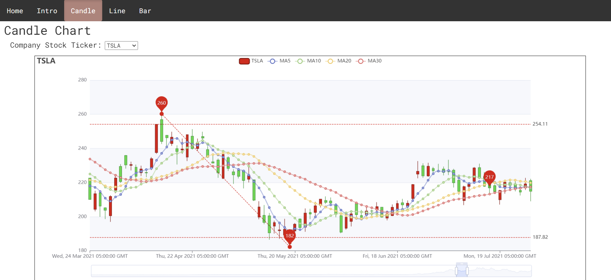
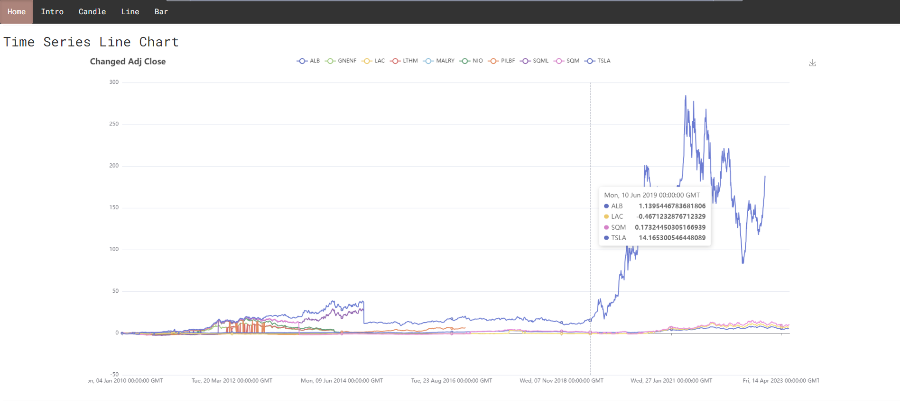
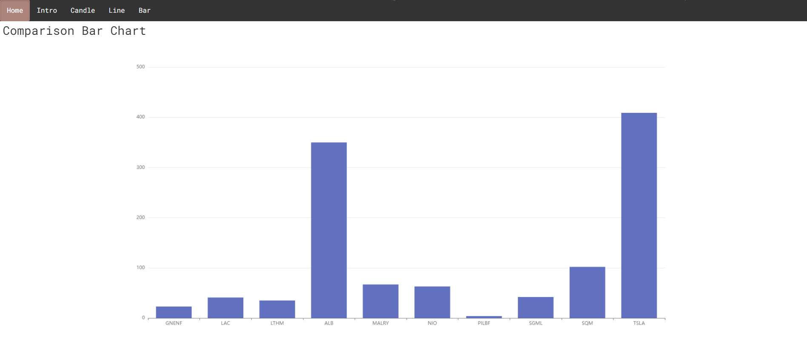

# **Project 3: Lithium Stock Market Analysis**

<strong>Team:</strong>Borna Karimi, Estelle Santini, Jesus Jimenez, Nick Wetherell, Shih-Hsien Ma
 
<strong>Program:</strong> Berkeley Data Analytics Bootcamp
 
<strong>Date:</strong> 06/27/2023

## **Overview**
Lithium stocks are shares of companies that are involved in producing, supplying, or using lithium, a crucial element to lithium-ion batteries. These batteries are used extensively for various applications including electric vehicles, portable electronics, renewable energy solutions, aerospace, military defense, and medical devices. The demand for for lithium has exponentially grown as a mineral due to it’s significance in clean energy and relevant fields. As a stock, it has equally grown in interest as investors recognize it’s potential for growth.
  
In this project, we are analyzing and presenting a narrative on the historical trends and relationship between companies that supply and demand lithium through three data visualizations - a candlestick chart, a line graph, and a bar graph. Lithium producers include ALB, GNENF, LAC, LTHM, MALRY, PILBF, SGML, SQM and lithium users are NIO, Samsung, and TSLA. Bringing together SQL, sqlalchemy, python, APIs, flask APIs, web development including Html, Css, JavaScript, and incorporating a new package called Apex Charts, to show the trends for eleven tickers in the lithium stock market.

## **Preparing the Data**
To prepare the data for the stocks in the following table, we downloaded historic stock data as csv files for the given date ranges. These csv’s include data on the stock's Date, Open, High, Low, Close, Adj Close, and Volume for a given day in the date range. Using PostgreSQL, we created a relational database, building tables  to use in our data visualization and web development. 
  
| Ticker | Company Name | Date Range of Data |
|----------|----------|----------|
| ALB | Albemarle Corporation | 2010 - 2023 |
| GNENF | Ganfeng Lithium Ord Shs H | 2019 - 2023 |
| LAC |  Lithium Americas Corp | 2010 - 2023 |
| LTHM | Livent Corp | 2018 - 2023 |
| MALRY | Mineral Resources ADR | 2010 - 2023 |
| NIO | Nio Inc - ADR | 2018 - 2023 |
| PILBF | Pilbara Minerals Ltd | 2016 - 2023 |
| SAMSUNG | Samsung Electronics Co Ltd | 2010 - 2023 |
| SGML | Sigma Lithium Corp | 2018 - 2023 |
| SQM | Sociedad Quimica y Minera de Chile | 2010 - 2023 |
| TSLA | Tesla Inc | 2010 - 2023 |

## **Candle Stick Chart**
The Candle Stick Chart is connected to a dropdown menu where you can select a company's ticker. The green candles show when the stock's prices rose, while the red candles show a drop in stock price. This chart shows a dotted red line for the high and low, as well as a diagonal line to show the difference from the high and low prices. 
  
There is also a high level of interaction beyond selecting which stock you would like to visualize. If you hover your cursor along the candles, a pop up will show the stock name, open, close, low, and high price for that day; it also shows the MA5, MA10, MA20, and MA30 which are the moving averages for 5, 10, 20, and 30 days. These moving averages can be selected or deselected from the top of the graph. There are also zoom functionalities and a graph below to show what time range you are visualizing in the timeline of data.
  

## **Time Series Line Chart**
In this line chart, we have visualized the percentage change for the adjusted close price for each stock. This shows the percentage change from the first adjusted close price in January of 2010 to that point. Users are able to select which stocks they want to compare by selecting or deselecting stocks from the top of the graph to display multiple lines at once. Users can also download a picture and hover over lines to see information on the selected to show the tickers' adjusted close price.
  

## **Comparison Bar Chart**
To conclude our data visualizations, the comparison bar chart shows the highest adjusted close price for each stock for our dataset. By pressing on a bar, you can see the annual breakdown of the highest adjusted close prices for each year by stock. You can go back by pressing "Back" and look at a different stock's adjusted close prices.
  
